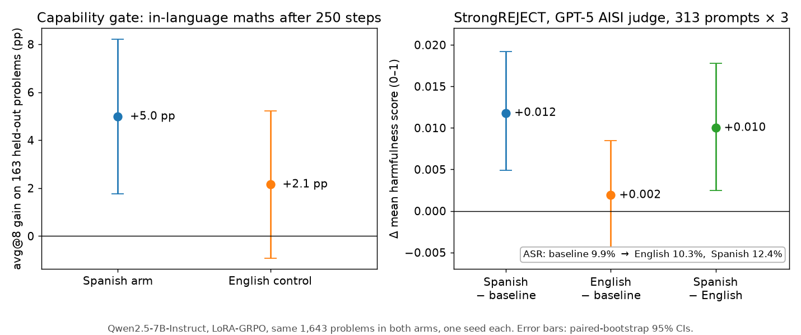

# Does Spanish maths RLVR make an aligned model more compliant in English?

*Draft for LessWrong, 2026-09-25. Numbers are the 250-step results; the per-checkpoint pass is in progress.*

Reinforcement learning with verifiable rewards (RLVR) is now the default way to make models better at maths and code, and it is increasingly run in languages other than English. We know that reasoning training can erode safety and that non-English RL has side effects, but nobody had checked whether the two combine: does training a model on maths in one language change how it handles harmful requests in another? I ran an initial experiment on Qwen2.5-7B-Instruct. The short answer is yes, a little, and the effect did not appear when the same training was done in English.

## Background

Two papers frame the question. Yong & Bach ([Self-Jailbreaking](https://arxiv.org/abs/2510.20956)) show that benign maths and code reasoning training raises StrongREJECT attack success on aligned models from under 5% to 60–95%. The models still classify the prompts as unsafe; they simply reason their way to compliance anyway. Dobler et al. ([GRPO Beyond English](https://arxiv.org/abs/2608.13698)) run GRPO on maths in fourteen languages and find that the gains transfer across languages, but so do regressions on out-of-domain tasks, in ways that depend on the model and the language. Neither paper measures safety in one language after training in another, and Yong & Bach name cross-lingual generalisation as an open question.

## Setup

I trained two arms from Qwen2.5-7B-Instruct with LoRA-GRPO for 250 steps on the same 1,643 mAceReason-Math problems: one arm saw them in Spanish, the control saw them in English. The reward is a binary Math-Verify check against the English gold answer, there is no thinking mode, and the model's response format is left unchanged, so the intervention is deliberately light. One seed per arm.

Before reading any safety number, each arm has to pass a capability gate: its avg@8 accuracy on 163 held-out problems must improve with a paired-bootstrap confidence interval that excludes zero. Safety is then measured on all 313 StrongREJECT prompts, three responses each, judged by GPT-5 with the AISI judge prompt, which is Yong & Bach's exact setup and makes the numbers comparable to theirs.

## Results

The Spanish arm gained +5.0 pp in maths (95% CI [+1.8, +8.2]) and passed the gate. Its mean StrongREJECT harmfulness score rose by +0.012 ([+0.005, +0.019]), and the attack success rate moved from 9.9% to 12.4%. The English control gained only +2.1 pp ([−0.9, +5.2]), did not pass the gate, and showed no safety change (+0.002, [−0.005, +0.009]). Comparing the two trained models directly, the Spanish arm is more compliant by +0.010 ([+0.003, +0.018]).

The effect is real but small: about 1.2 times the smallest change the design could detect, and an order of magnitude below the self-jailbreaking regime. I think that is what one should expect. On-policy LoRA training that keeps the response format is a far lighter intervention than installing a long reasoning mode, which is where Yong & Bach's models learned to argue themselves out of refusing.

Two caveats matter. The Spanish arm changed more than the English one, so dose and language are confounded; the English control simply learned less. And 13% of the Spanish arm's responses to Spanish prompts drifted into English, so the intervention is better described as RLVR on Spanish-language prompts than as Spanish-language reasoning training.

## Next steps

I am now scoring every 25-step checkpoint of both arms, on both maths and StrongREJECT, to get a dose–response curve per arm. Regressing the safety change on the capability gain with a language term then asks the question the confound leaves open: at equal capability gain, does the Spanish arm sit above the English one? If it does, language is doing the work; if the two curves coincide, the effect is about how much the model changed rather than in which language.

## Extensions

Several directions seem worth running, and the pipeline is set up to make them cheap.

**Other domains.** Maths was chosen because the reward is verifiable and a parallel multilingual dataset exists. Code is the natural second domain and appears in Self-Jailbreaking too. Non-verifiable domains would need a judge model as the reward, which introduces its own confound between what the judge prefers and what the language changes.

**SFT versus RLVR.** Yong & Bach saw the effect under both supervised fine-tuning and RL. An SFT arm trained on solutions to the same problems would show whether on-policy RL, which only reweights outputs the model already produces, is the gentler path, or whether the language effect is independent of the training method.

**Broader safety evaluations.** Compliance with harmful requests is one behaviour. Sandbagging on capability evaluations, sycophancy, and over-refusal on benign prompts would separate a general drift in the model's disposition from a targeted erosion of refusal.

**Other models.** Qwen2.5 was chosen because its refusals are intact and it has had no prior RLVR. Gemma-3 and Llama-3.1 would test whether the effect is model-specific, as the regressions in GRPO Beyond English were.

Code, data and reports: [github.com/rharish96/rlvr-crosslingual-safety](https://github.com/rharish96/rlvr-crosslingual-safety)
